# DecisAI - AI Bidding Engine

> An AI-assisted procurement intelligence and bid-response platform for **RFPs, RFQs, and tenders**.

DecisAI takes a procurement document from upload to an evidence-backed **GO / NO-GO** recommendation. Instead of treating an LLM as the source of truth, the system combines document intelligence, semantic retrieval, transparent compliance rules, grounded generation, validation, and bid scoring into one auditable workflow.

**Upload → Extract → Retrieve Evidence → Compliance → Draft → Validate → Score → Decide → Export**

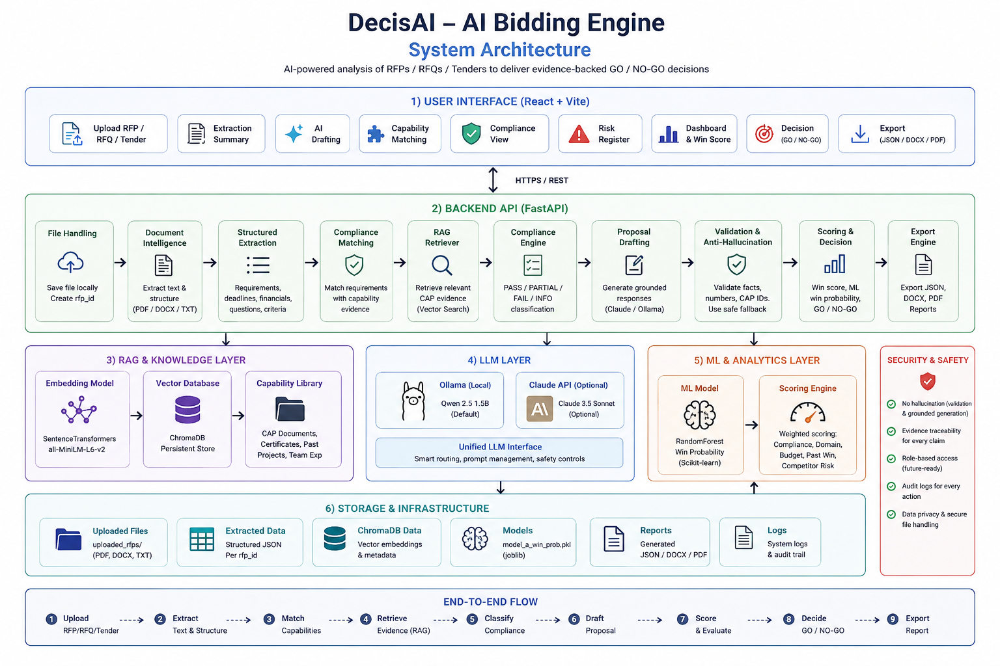

## Why DecisAI?

Preparing a serious bid means reading long tender documents, finding mandatory requirements, checking whether the company can actually satisfy them, locating supporting past-project evidence, drafting responses, identifying risks, and deciding whether the opportunity is worth pursuing.

DecisAI turns that process into a structured workflow while keeping the evidence visible and the human decision-maker in control.

## What It Can Handle

### Procurement Documents

DecisAI is built for **RFPs, RFQs, and tender documents** and accepts:

- PDF
- DOCX
- TXT
- Markdown

The document-intelligence layer extracts text from the complete uploaded document and builds **sliding-window chunks with overlap** for downstream processing. This makes the pipeline suitable for **large, multi-page procurement documents**, including documents containing hundreds of individual requirements. Actual practical limits depend on document size, structure, available RAM/CPU, and the extraction/model configuration.

### Company / Bid Datasets

The data layer works with structured bid and capability datasets stored in **XLSX** files using pandas/openpyxl. The included sample contains bid-history data and a capability library that is cleaned, transformed, embedded, and indexed for retrieval.

This creates an important separation:

**Tender/RFP/RFQ = what the buyer requires**  
**Capability Library = what the company can prove**

The RAG layer connects the two.

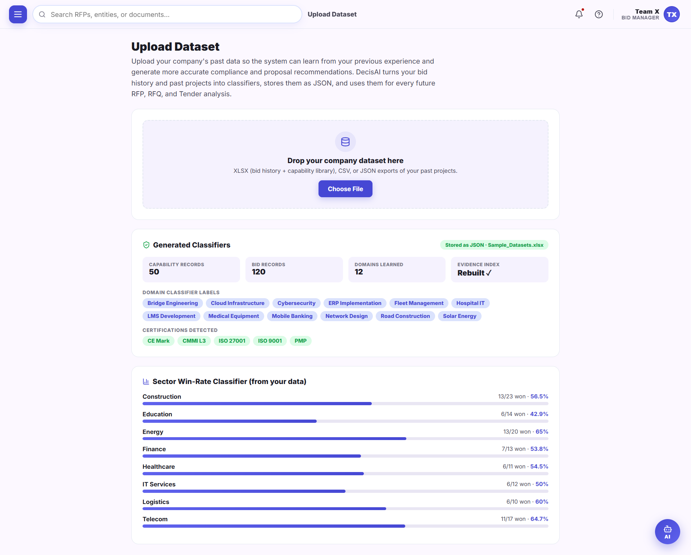

## Core Workflow

### 01. Upload

A user uploads an RFP, RFQ, or tender through the React interface. FastAPI stores the document and creates a workflow ID.

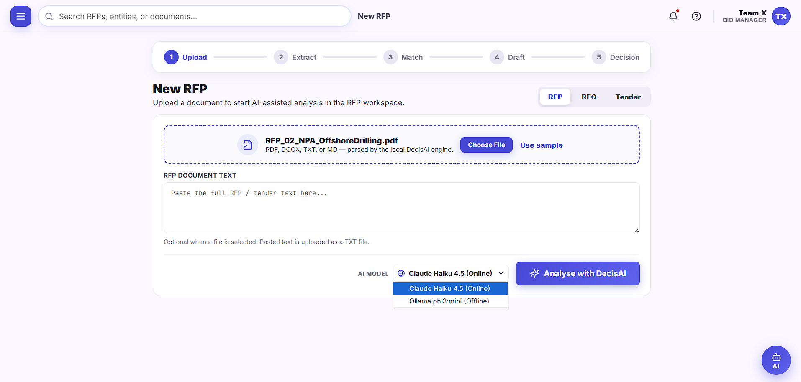

### 02. Document Intelligence

`doc_intel.py` extracts structured information including:

- requirements
- mandatory and optional obligations
- evaluation criteria
- deadlines
- financial figures
- questions
- metadata
- document chunks

The baseline extraction is deterministic and explainable. Optional LLM enrichment can improve requirement/question discovery when a provider is available.

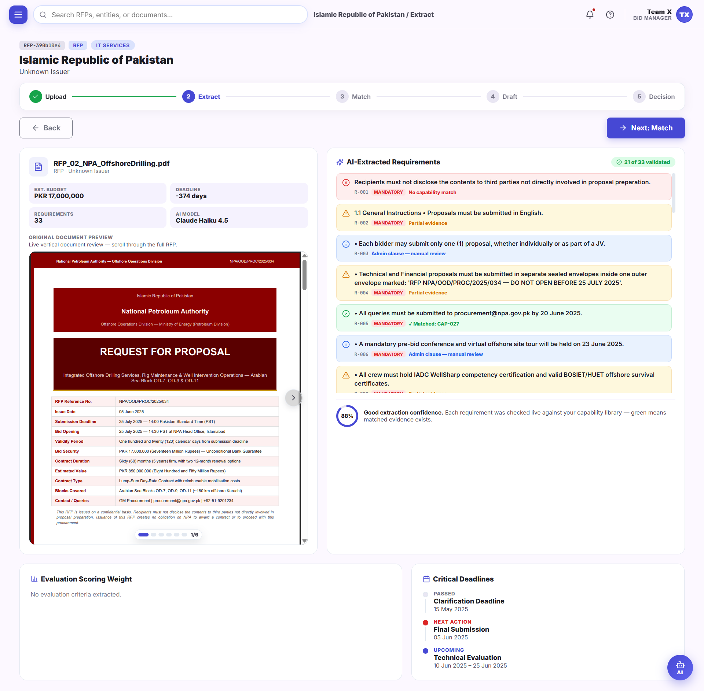

### 03. RAG Evidence Retrieval

Requirements are embedded with **SentenceTransformers `all-MiniLM-L6-v2`** and searched against a persistent **ChromaDB** capability index.

Retrieved evidence can include:

| Evidence | Example |
|---|---|
| Capability ID | `CAP-001` |
| Domain | Cybersecurity |
| Certification | ISO 27001 |
| Client Type | International |
| Contract Value | PKR 15M |
| Duration | 34 months |
| Year Completed | 2023 |
| Similarity Score | 0.727 |

The retriever also maps bid sectors to relevant capability domains and applies a small domain boost before thresholding weak matches.

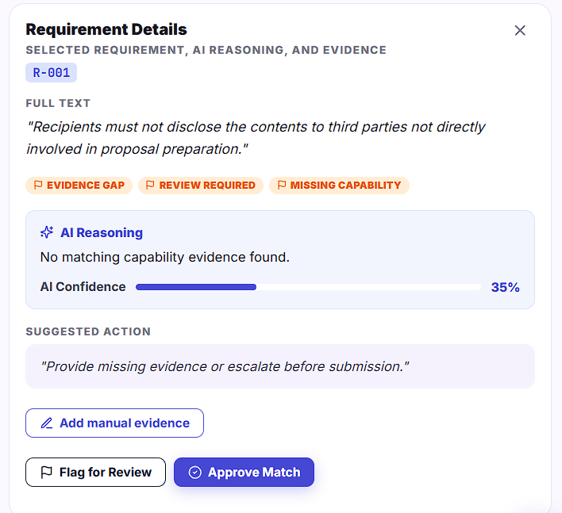

### 04. Compliance Classification

Each capability-oriented requirement is classified with transparent rules:

| Status | Meaning |
|---|---|
| **PASS** | Strong evidence supports the requirement |
| **PARTIAL** | Some relevant evidence exists, but coverage is incomplete |
| **FAIL** | No acceptable capability evidence was found for a mandatory requirement |
| **INFO** | Administrative/financial information that should be tracked separately |

The compliance classifier is intentionally **rule-based**, because the source bid data does not contain trustworthy PASS/PARTIAL/FAIL labels for supervised training. Presenting fabricated labels as ML would make the system less credible, not more.

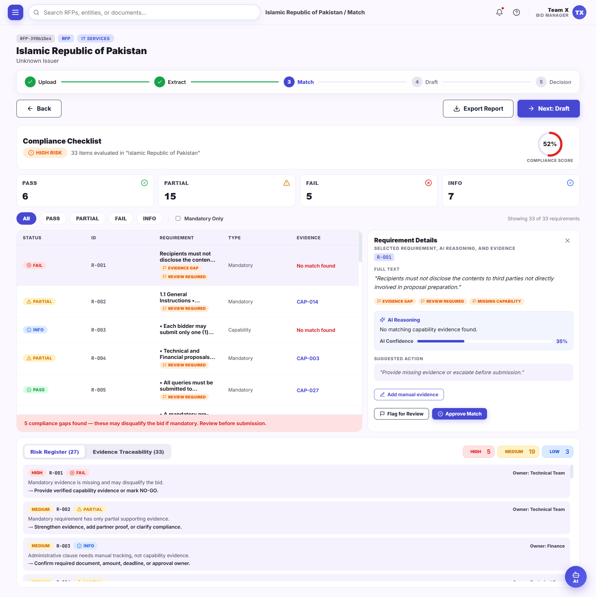

### 05. Grounded Proposal Drafting

DecisAI uses a provider chain for proposal generation:

```text
Optional Claude
      ↓
Local Ollama / Qwen 2.5 1.5B
      ↓
Deterministic grounded template
```

The important part is not the choice of model. It is the validation layer around the model.

Every generated response is checked for:

- invented capability IDs
- invented numerical values
- unsupported units
- unsupported capacity claims
- unsupported team/personnel claims

If a generated answer fails validation, the system retries the local model when appropriate and ultimately falls back to a deterministic evidence-backed template.

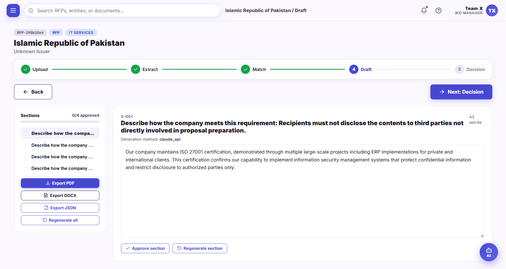

### 06. Risk Register

Weak matches, failed requirements, and administrative items can be surfaced as risks with ownership/action context in the UI so that a bid is not judged on a single score alone.

### 07. Bid Scoring

The scoring layer combines five signals:

- compliance
- domain match
- budget alignment
- historical win rate
- competitor presence/risk

The project also includes a genuine **RandomForest win-probability model** trained on the supplied bid-history data. The model uses sector plus numeric bid features such as budget, score, compliance, response time, document pages, and gaps found.

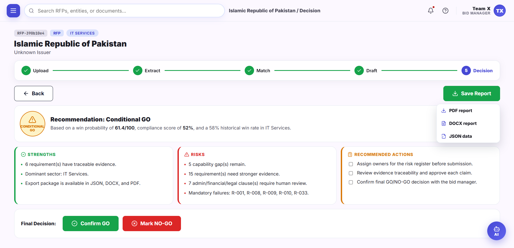

### 08. GO / NO-GO Decision

The decision layer converts the evidence and scoring signals into an actionable recommendation:

**GO · CONDITIONAL GO · HIGH RISK · NO-GO**

The final choice remains human-confirmed. DecisAI is a decision-support system, not an autonomous bidding authority.

### 09. Export

Final workflow data can be exported as:

- JSON
- DOCX
- PDF

## End-to-End Architecture

```text
                               DecisAI
                                  │
                    ┌─────────────▼─────────────┐
                    │      React + Vite UI      │
                    │ Dashboard • Upload • RAG  │
                    │ Compliance • Draft • Score│
                    └─────────────┬─────────────┘
                                  │ HTTP / JSON
                                  ▼
                    ┌───────────────────────────┐
                    │      FastAPI Backend      │
                    │ API + Workflow Orchestration│
                    └─────────────┬─────────────┘
                                  │
          ┌───────────────────────┼────────────────────────┐
          │                       │                        │
          ▼                       ▼                        ▼
┌───────────────────┐   ┌───────────────────┐   ┌────────────────────┐
│ Document Intel    │   │ Evidence / RAG     │   │ Scoring + ML       │
│ PDF/DOCX/TXT/MD   │   │ MiniLM + ChromaDB  │   │ Rules + RandomForest│
│ Regex / Heuristics│   │ Capability Library │   │ Win Probability     │
└─────────┬─────────┘   └──────────┬────────┘   └─────────┬──────────┘
          │                        │                      │
          └────────────────────────┼──────────────────────┘
                                   ▼
                       ┌────────────────────────┐
                       │ Grounded LLM Layer     │
                       │ Claude (optional)      │
                       │ Ollama + Qwen 2.5 1.5B │
                       │ Validation + Fallback  │
                       └────────────┬───────────┘
                                    ▼
                       ┌────────────────────────┐
                       │ Decision + Export      │
                       │ GO/NO-GO • JSON/DOCX/PDF│
                       └────────────────────────┘
```

The supplied architecture documentation describes the same flow from document upload through extraction, evidence retrieval, compliance, grounded drafting, validation, scoring, human confirmation, and export. The public repository uses a clean architecture graphic rather than committing the original PDF.

## AI / ML Stack

| Layer | Technology |
|---|---|
| Frontend | React 19, Vite, JavaScript, Lucide React |
| Backend | FastAPI, Python |
| PDF extraction | PyMuPDF, pdfminer.six |
| DOCX extraction | python-docx |
| Embeddings | SentenceTransformers `all-MiniLM-L6-v2` |
| Vector store | ChromaDB |
| Local LLM | Ollama + `qwen2.5:1.5b` |
| Optional cloud LLM | Claude API provider |
| Win-probability model | scikit-learn RandomForest |
| Data processing | pandas, openpyxl |
| Model persistence | joblib |
| Proposal export | python-docx, PyMuPDF |

## Anti-Hallucination Design

The most important engineering feature in DecisAI is that **generation is not accepted just because it is fluent**.

The validator checks whether the model:

1. cites capability IDs that actually exist in the retrieved evidence;
2. introduces numbers that were not present in the question/evidence;
3. introduces unsupported units such as MW, km, Gbps, users, etc.;
4. turns available facts into unsupported capacity claims; and
5. invents personnel/team facts that are not present in the capability data.

A rejected generation moves to the next safe stage instead of being shown as a trusted answer.

```text
LLM output
    │
    ▼
Validate JSON/schema
    │
    ├── valid + grounded ──► return response
    │
    └── rejected ──────────► retry / fallback
                                   │
                                   ▼
                         grounded deterministic answer
```

This makes the worst-case output **less polished, not more fabricated**.

## Backend Modules

| File | Responsibility |
|---|---|
| `files-worker/main.py` | FastAPI endpoints and workflow orchestration |
| `files-worker/doc_intel.py` | Procurement-document extraction, chunking, requirements, questions, deadlines, financials |
| `files-worker/data_prep.py` | Bid/capability dataset loading and preparation |
| `files-worker/rag_setup.py` | Embeddings, ChromaDB indexing and evidence retrieval |
| `files-worker/llm_module.py` | LLM orchestration, validation and fallback |
| `files-worker/ollama_client.py` | Local Ollama client |
| `files-worker/claude_client.py` | Optional Claude provider |
| `files-worker/template_fallback.py` | Deterministic grounded response generation |
| `files-worker/train_models.py` | RandomForest win model + rule-based compliance logic |
| `files-worker/proposal_export.py` | DOCX/PDF generation |

## API Flow

```text
POST /api/upload
        │
        ▼
GET /api/rfp/{id}/extract
        │
        ▼
POST /api/rfp/{id}/match
        │
        ▼
POST /api/rfp/{id}/draft
        │
        ▼
GET /api/rfp/{id}/score
        │
        ▼
GET /api/rfp/{id}/decision
        │
        ▼
POST /api/rfp/{id}/decision
        │
        ▼
JSON / DOCX / PDF
```

The backend also exposes lower-level compliance, answer-generation, win-score, and health endpoints.

## Running Locally

### Backend

```bash
cd files-worker
python -m venv venv

# Windows
venv\\Scripts\\activate

# macOS/Linux
source venv/bin/activate

pip install -r requirements.txt
```

Build the capability index and train the win model when needed:

```bash
python data_prep.py
python train_models.py
python rag_setup.py
```

Start the API:

```bash
python -m uvicorn main:app --reload
```

### Local LLM

```bash
ollama pull qwen2.5:1.5b
ollama run qwen2.5:1.5b
```

The Ollama client talks to the local Ollama service at `localhost`; it does not need a cloud API key.

### Frontend

```bash
cd UI
npm install
npm run dev
```

## Testing

```bash
cd files-worker
python test_doc_intel.py
python test_module1.py
```

The included test suite covers extraction behavior, schema validation, retrieval/compliance behavior, hallucination guards, model loading, and fallback behavior.

## Repository Screenshots

### Dashboard
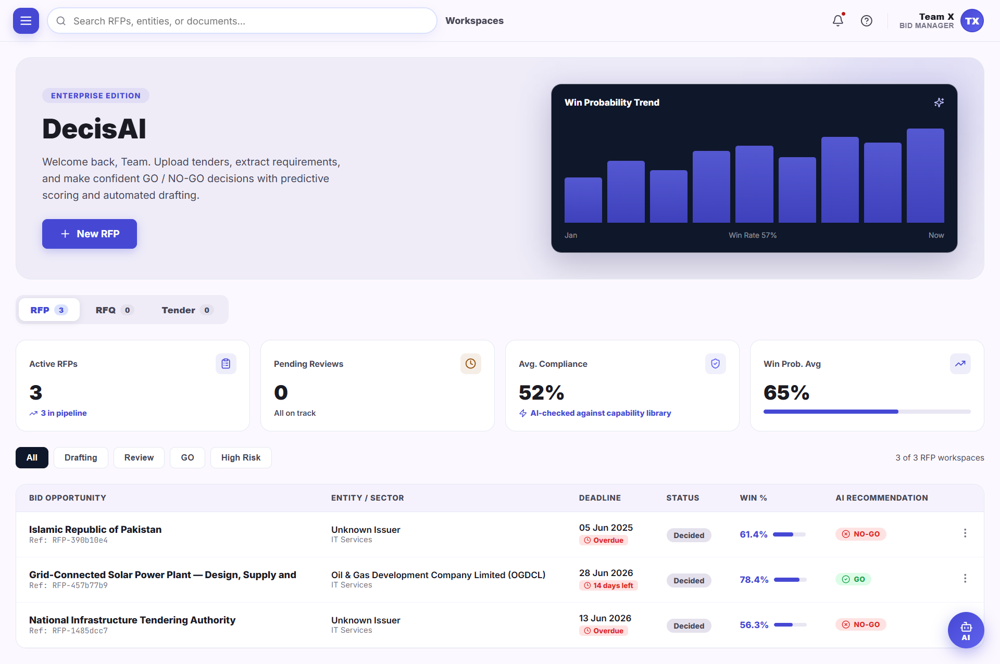

### 500+ Requirement Example
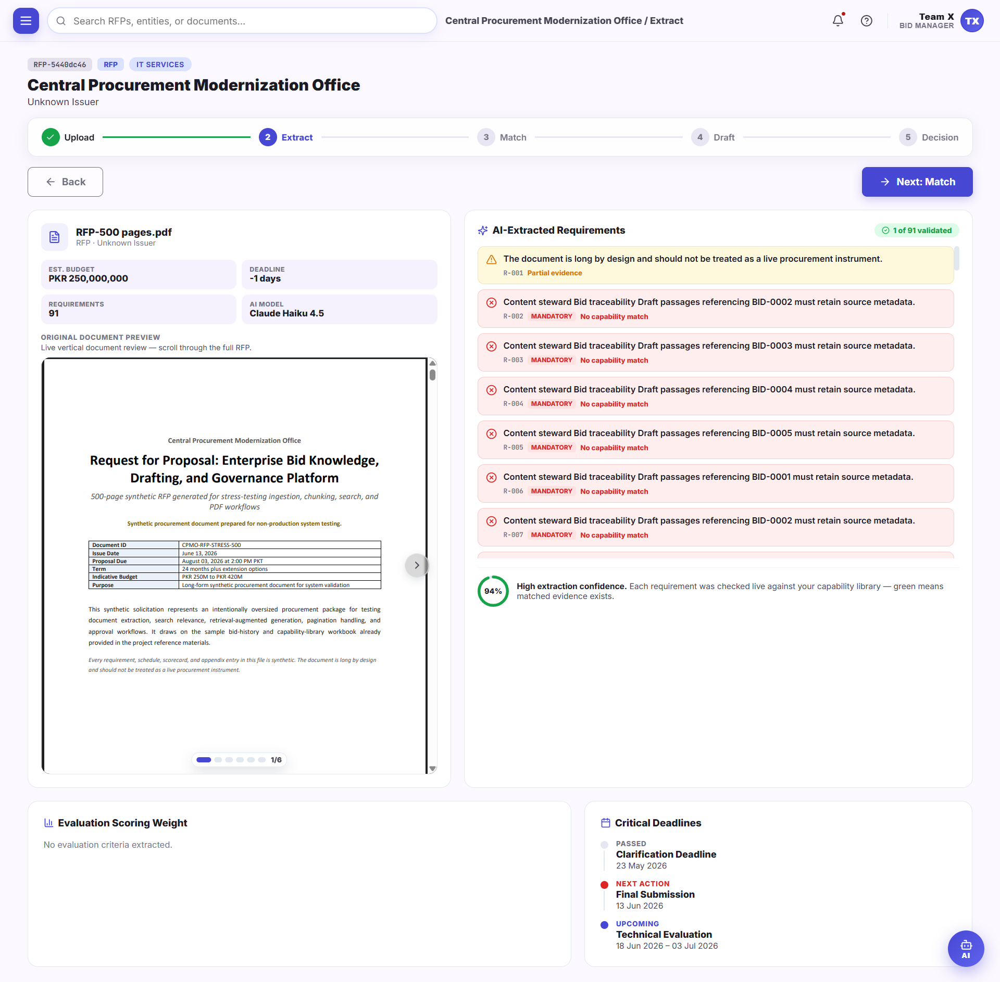

### Capability Matching


### Compliance Matrix


### AI Drafting


### Bid Decision


### End-to-End Workflow
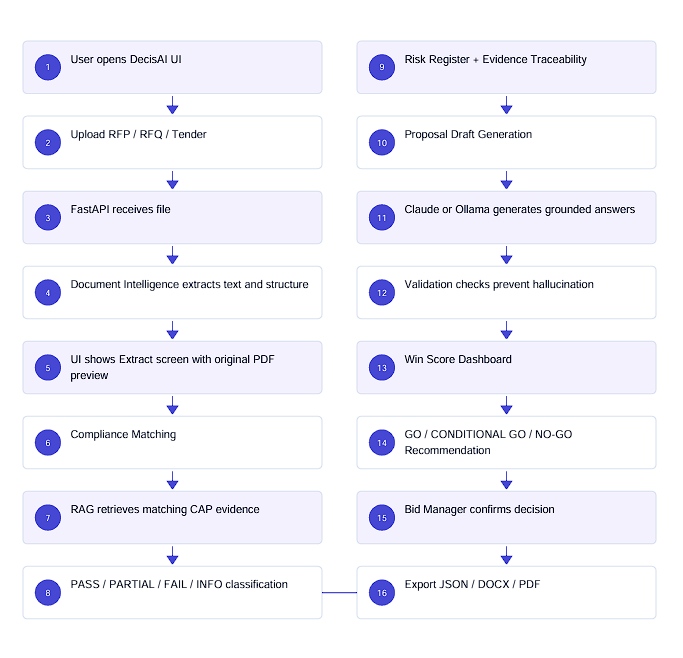

## Security

No live API credential is intentionally committed to this repository.

- `.env` files are ignored by Git.
- `.env.example` contains placeholders only.
- Local runtime state and ChromaDB data are ignored.
- Generated model artifacts are ignored and can be regenerated locally.
- The original architecture PDF is not included; selected visuals are stored as images instead.

## Project Status

**Hackathon / functional prototype**

The core pipeline is implemented end-to-end, but production deployment would still require stronger authentication, persistent production storage, hardened file handling, richer claim-level semantic validation, observability, and additional scaling work for enterprise workloads.

## One-Line Pitch

**DecisAI reads RFPs, RFQs, and tenders, extracts what the buyer requires, finds what the company can prove, checks compliance, drafts evidence-backed responses, scores bid viability, and helps a human make the final GO / NO-GO decision.**

## Hackathon Note

Built as a practical AI-assisted procurement and bid-response system, DecisAI combines deterministic document intelligence, RAG, local LLM inference, grounded generation, transparent compliance logic, machine-learning-assisted win scoring, and human-in-the-loop decision support.
